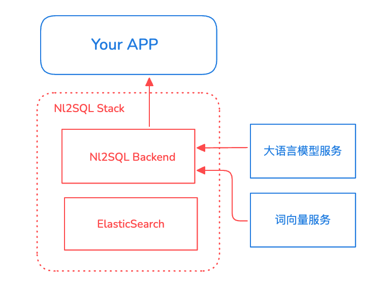

<p align="center">
  
</p>


NL2SQL 是一个基于大语言模型的自然语言转SQL（NL2SQL）后端服务，支持将用户的自然语言查询转换为结构化的SQL语句。可无缝嵌入任何需要自然语言生成SQL的系统之中。

## 功能特性

- **自然语言转SQL**：将自然语言查询智能转换为SQL语句
- **大模型支持**：支持各种大模型推理服务，包括OpenAI、DeepSeek、Qwen等
- **多表推荐**：基于语义匹配自动推荐相关数据表
- **业务知识融合**：支持业务知识库和同义词管理
- **字段值匹配**：智能识别和匹配维度值
- **流式生成**：支持SQL语句的流式生成输出
- **RESTful API**：提供标准的RESTful API接口
- **Docker部署**：支持Docker和Docker Compose快速部署

## 项目架构

<p align="center">
  
</p>

- **后端框架**：FastAPI
- **向量数据库**：Elasticsearch
- **词向量服务**：BGE词向量模型
- **大语言模型**：支持OpenAI兼容接口
- **部署方式**：Docker容器化部署

## 快速开始

### 环境要求

- Docker & Docker Compose
- BGE词向量服务
- OpenAI兼容的大模型服务

### 使用Docker Compose部署

1. 在docker-compose中配置所需要的环境变量

2. 启动服务
```bash
docker-compose up -d --build

# 服务默认启动在locahost:8001
```

3. 访问API文档
```
http://localhost:8001/docs
```

### 本地开发

如需本地运行，需要根据 Dockerfile 配置相应的环境。

1. 环境要求
- Python 3.12+
- 安装 uv 包管理工具

2. 创建虚拟环境并安装依赖
```bash
# 安装 uv
pip install uv

# 使用 uv 安装依赖（与 Dockerfile 保持一致）
uv pip install --no-cache-dir --upgrade -r sqlcopilot/restful/requirements.txt --system
```

3. 配置环境变量

4. 启动服务
```bash
cd sqlcopilot/restful
fastapi run app/main.py --port 8080
```

**注意**：推荐使用 Docker Compose 部署，以确保环境一致性。

## API接口

详细使用说明及API文档请参见 [API文档](documentation/api.md)。

### 主要接口

- `POST /nl2sql/generate` - 生成SQL语句
- `POST /nl2sql/stream` - 流式生成SQL语句
- `POST /nl2sql/explain` - SQL语句解释
- `POST /nl2sql/comment` - 为SQL添加注释
- `POST /nl2sql/correct` - SQL语句纠错

### 请求示例

```json
# POST /nl2sql/generate
{
  "query": "查询最近一个月销售额超过100万的产品",
  "bizid": "your_business_id",
  "context": {
    "table_retrieve_threshold": 0.2,
    "deep_semantic_search": true
  }
}
```

### 响应示例

```json
{
  "status": "success",
  "query": "查询最近一个月销售额超过100万的产品",
  "sql": "SELECT product_name, SUM(sales_amount) as total_sales FROM sales_table WHERE sale_date >= DATE_SUB(CURRENT_DATE, INTERVAL 1 MONTH) GROUP BY product_name HAVING total_sales > 1000000",
  "message": "SQL generated successfully"
}
```


## 开发指南

### 添加新的语义向量服务

1. 在 `sqlcopilot/core/embedding.py` 中添加新的服务类，实现 `get_embedding(text: str) -> List` 方法
2. 在 `EmbeddingService.__init__` 方法中添加新提供商的条件分支
3. 更新配置文件，添加新服务的配置项

## 贡献指南

欢迎贡献代码！请查看 [CONTRIBUTING.md](CONTRIBUTING.md) 了解详细的贡献指南。

## 许可证

本项目采用 [MIT License](LICENSE) 开源协议。